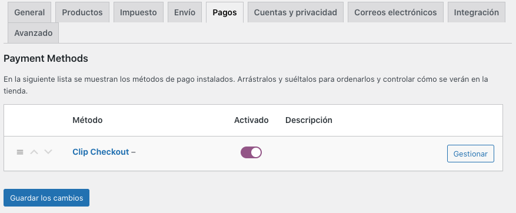
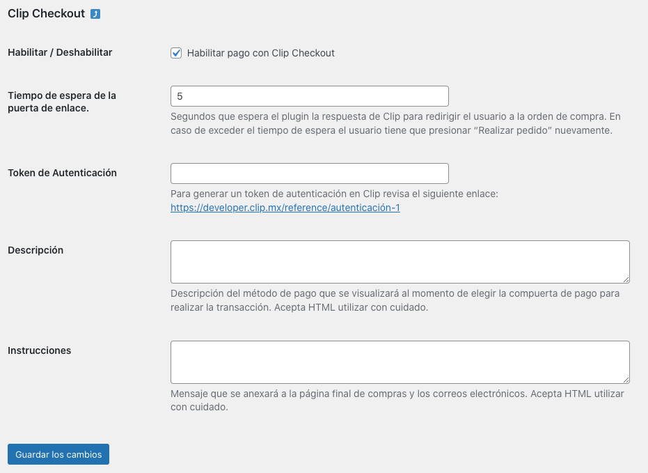
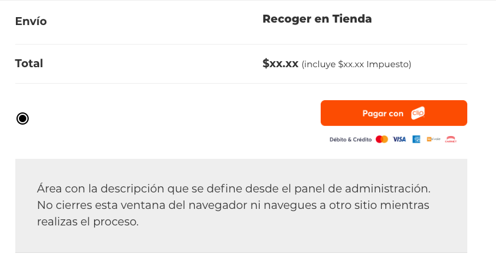
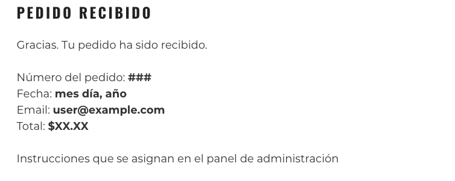
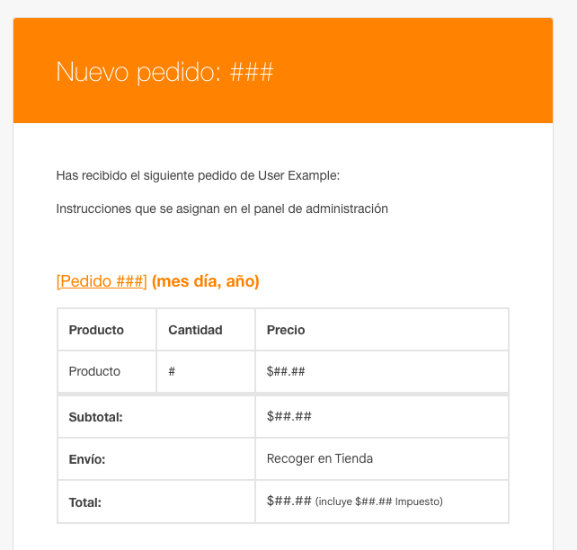

# clip-payment-gateway

## Plugin de [WordPress](https://wordpress.org/) / [WooCommerce](https://woocommerce.com/) para utilizar [Clip Checkout](https://developer.clip.mx/reference/introducción-a-clip-checkout) como compuerta de pago.  

Una referencia más completa la puedes encontrar en: [https://blog.eamexicano.com/wordpress/checkout-clip/](https://blog.eamexicano.com/wordpress/checkout-clip/)

## Instalación
Se instala como cualquier plugin.  
La configuración se realiza desde el área de "Ajustes > Pagos" de WooCommerce.  

- Descargar el archivo.zip
- Plugins > Añadir Nuevo > Subir plugin
- WooCommerce > Ajustes > Pagos

## Capturas
Una vez hecho lo anterior se debe de mostrar "Clip Checkout" como método de pago.  
Para configurarlo hay que activarlo.

### Ajustes
- Tiempo de espera: Al momento de presionar "Realizar pedido" se envía una notificación a Clip para crear una orden de compra. El tiempo de espera son los segundos que esperamos a que Clip genere la orden de compra y nos devuelva la URL a la cuál vamos a dirigir al usuario a que realice el pago.
- Token de autenticación: Para generar los enlaces de pago asociados a tu cuenta necesitas crear este token.  
- Descripción: Mensaje que se muestra al usuario debajo del botón "Pagar con Clip".
- Instrucciones: Mensaje que es importante que el usuario tenga presente porque se muestra en la página de agradecimiento y en los correos electrónicos.  

Al momento de elegir la compuerta de pago se debe visualizar el botón "Pagar con Clip"

Una vez realizado el pago hay una redirección a la página de agradecimiento - Thank you Page -
en la cual se visualizan las instrucciones definidas en el panel de administración.

En los correos enviados también se visualizan las instrucciones definidas en el panel de administración.

### Limitaciones
Checkout Clip acepta únicamente peso mexicano (MXN) como moneda.
Es necesario enviar el monto total de la compra (incluyendo gastos de envío e impuestos).
El texto utilizado en concepto es el nombre del dominio más el id del pedido en WooCommerce.
Lo anterior es para prevenir que el texto se corte ya que Clip acepta como valor máximo 255 caracteres.
Las instrucciones sólo se envían en los correos de las órdenes de compra cuyo estatus sea: 'on-hold', 'processing', 'completed'.